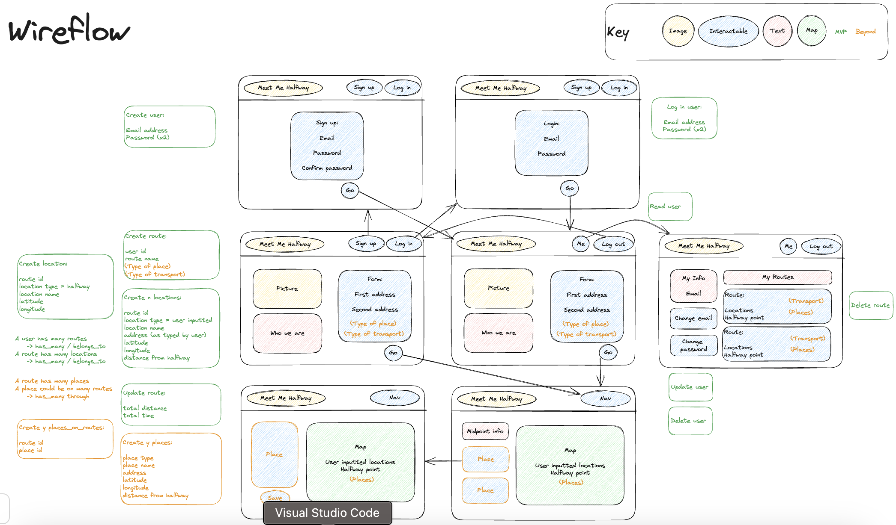
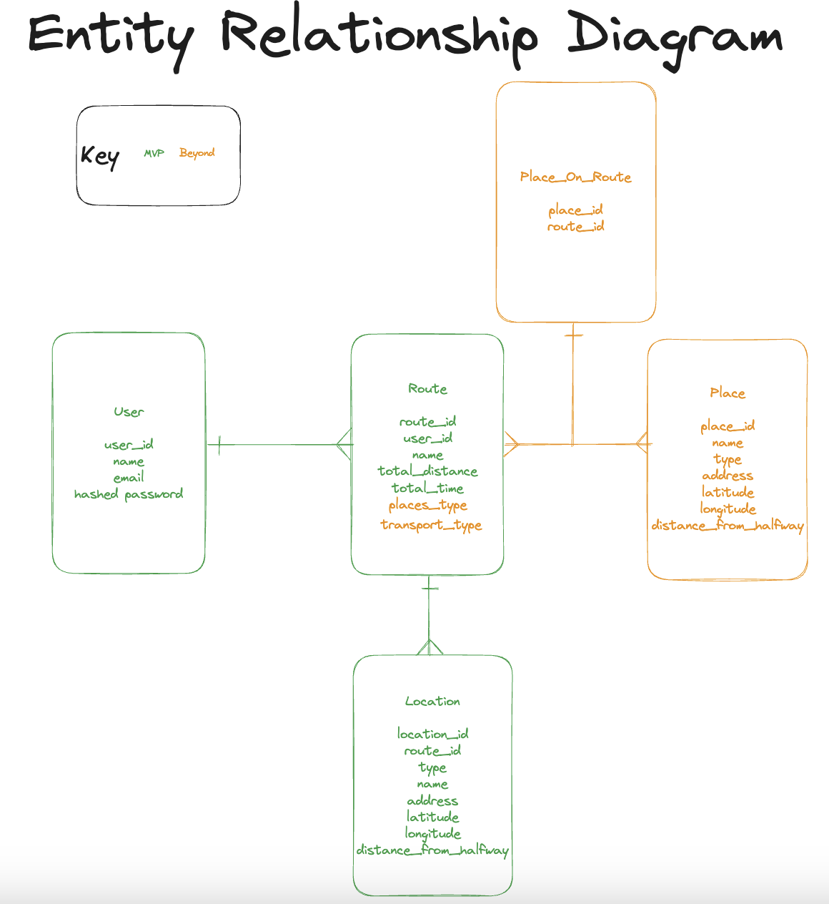

# Meet Me Halfway

This repo contains the source code for my fourth and final project of General Assembly's Software Engineering Immersive course (13th March - 9th June 2023). 

The project is my first attempt to showcase the skills I have been picking up in Ruby on Rails, which was totally new to me before the course.

Project 4 runs from 30th May - 8th June (7 working days) and is an independent project.

___

## Deployment

[Meet someone halfway now via Heroku](fierce-shore-56427.herokuapp.com/)

___
## Technologies Used

- Front end
    - Ruby
    - Bootstrap
- Back end
    - Rails
- VS Code
    - Text editing
    - Accessing Git via CLI
- Chrome developer tools
    - Inspecting elements, layout etc
    - Debugging
- Heroku
    - Deployment
- Ruby Gems
    - Devise: User authentication
    - Google Maps: external API calls
    - HTTParty: external API calls

___

## Brief

### Big Goals

1. A full stack web application, with:
    1. At least 2 models with full CRUD on at least one model and Add/Delete on any remaining models, and
    1. User authentication

### Technical Requirements

- Have at least 2 models
- Use authentication
- Have full CRUD on at least one model
- Be able to Add/Delete on any remaining models
- Have high quality code:
    - Follow accepted naming conventions
    - Consistent indentation
    - Well-structured and readable code
    - Semantic naming of variables, functions, CSS classes, etc.
    - Short and clear functions that do one thing
    - Efficient code - MVP first, then refactor
    - DRY (Don't Repeat Yourself) code
- Be deployed on Heroku or similar platform
- A README.md file that explains the app

### Full Brief

Found at https://git.generalassemb.ly/SEI-LND-71/Project-4

___

## Planning

### User Stories

#### Minimum Viable Product (MVP)

- As a user, I want to input two locations for myself and another person, so we can find a halfway point that minimises our travel distances.
- As a user, I want to see the halfway point on a map, so I can visualise potential meeting locations.
- As a user, I want to save meetings, so I can revisit them later.
- As a user, I want to keep my information private, so I don't get hacked.

#### Beyond MVP

- As a user, I want to input more than two locations, so I can find a halfway point for meetings with multiple people.
- As a user, I want to use log in information that I already use elsewhere, so I don't have to remember more passwords.
- As a user, I want to see driving directions from both locations to the meeting point, so I know how to get there.
- As a user, I want to select different modes of transport (e.g. walking, cycling, public transport) to calculate the meeting point, so I can find the best way to travel.
- As a user, I want to search for different types of places (e.g., restaurants, parks, coffee shops) near the halfway point on the map, so I can identify venues for our gathering.
- As a user, I want to filter the displayed places on the map based on specific criteria (e.g. cuisine type, rating), so I can find a venue that matches our preferences.
- As a user, I want to see information about the displayed places (e.g. contact details, reviews), so I can make a decision about where to meet.
- As a user, I want to save and share the meeting location, including the displayed places on the map, with other people, so we can all have access to the details.
- As a user, I want to see alternative meetings and estimated travel times for each mode of transport, so I can choose the best option for my journey.
- As a user, I want to see traffic information, so I can choose the best meeting time.

### Wireframe

I used Excalidraw to create a wireflow: 
A more detailed view can be found at: https://excalidraw.com/#json=xV65UtrBFz-0S5l1y3rgS,FmesD8ys3zkcZ3au7_Rhmg

### Entity Relationship Diagram

I used the same Excalidraw to draw an entity relationship diagram: 
A more detailed view can be found at: https://excalidraw.com/#json=xV65UtrBFz-0S5l1y3rgS,FmesD8ys3zkcZ3au7_Rhmg

### Project Management
I used [this Jira board](https://louisejones.atlassian.net/jira/software/projects/MMHW/boards/2/) to add in target start and end dates and time tracking estimates so I could check how realistic my original plans were.

___

## Build/Code Process

### Day 1

- Wireframe
- User Stories
- Planning
- ERD diagram
- Git set up
- Project skeleton set up

### Day 2

- Authentication using Devise
- MVC for users, meetings and locations
- Full CRUD on meetings and locations (CRUD for users provided by Devise)
- Deployment on Heroku

### Day 3

- More Heroku deployment
- Search page skeleton
- Results page skeleton

### Day 4
- Dashboard page skeleton
- Header content
- Footer content (https://simpleicons.org/, https://blog.cloud66.com/using-svgs-in-a-rails-stack)

### Day 5
- Google Maps API using the google-maps Ruby Gem
- Mapping functionality using HHTParty

### Day 6
- Putting the full user flow together from a search to the results

### Day 7
- Styling
- Extra routing functionality
    - Calculating the distance and time
    - Allowing more than two locations
- Final redeployment

___

## Challenges

- I have found some Gem documentation difficult to read and then apply to my work. It's not always clear with some Gems exactly how to use them, or if there are any behaviours/quirks to expect. Similarly, information on the internet is often outdated as technology moves so quickly. It's taken me longer than I would like to debug error codes coming from those gems too, as I'm less familiar with how they work.
- I'm finding that my time estimates are still quite hit and miss. It's usually clear (although not perfectly!) if something is "really quick" or "really slow" but I'd like to get better at estimating in the future.
- Day 6 was interrupted by repeated issues connecting to the internet and that has made me realise just how much I rely on that connectivity to move my thoughts onwards. I need to work on an offline rubber duck to help me when I need to talk/work through a problem.

___

## Wins
- The freedom we had in this project meant I was able to invest some time into an idea that I've had for over a decade but never before had the skills to implement. I have really enjoyed bringing my vision to life, particularly in designing the pages, and finally figuring out the logic.
- I made a point of tackling the more complicated requirements first: authentication and deployment. Knowing that I might struggle with these tasks, I didn't want to be panicking or running out of time later on. The unexpected benefit of this approach is that troubleshooting issues was much easier, as there were less 
- I was asked to help resolve a peer's issue, and was able to successfully debug their code. I love collaborating and am proud that I was seen as someone who could help, and was then able to do so! I also notified people about the best way to deploy after researching and testing it myself. The idea of saving other people time also makes me happy.

___

## Other Learnings/Takeaways
- At the beginning of a project, I like to write user stories for beyond MVP, so I have a sense of what I'm aiming for in the long term as well as over the course of the current working timeline. This is a double-edged sword, as it also means I can feel like I only made a small amount of progress towards the gold-plated version. I should (and do!) feel proud of the work I've achieved over the last week, and need to work on not letting the blue-sky vision overshadow this. It also made life easier when I wanted to add some beyond MVP functionality (allow more than two locations) as I had set up the form and controller to deal with an array of locations, so all I needed to do on Day 7 was to create a button that added another location, and the rest flowed through correctly.
- Looking back over my work, I started off really strongly, working through tickets quickly and seeing a lot of progress. My productivity dropped off in the second week, so I have been trying to understand why so I can avoid the same thing in the future.
    - I am highly motivated by novelty, which gives me a big boost when starting a new project.
    - I am highly motivated by deadlines, which gives me extra energy towards the end of a project.
    - Going forward, I need to work on "the boring middle" of a project so I can maintain momentum. For example, I will schedule easier tasks for this period, to account for having less energy at that time.

___

## Bugs
- The homepage form fields overlap their labels just before hitting the small screen breakpoint.
- I still have unused views that I created when I was originally testing my MVCs. Some of those are likely not working currently. I have kept them so that I can use them as a skeleton/reference when developing them in the future.

___

## Future Improvements
- Move from an embedded Google Map to a more customised version.
- Once a not-logged in user has created a meeting, allow them to sign in and automatically save the meeting they just created.
- Refactor the Google APIs: I'm sure that I am using too many API calls, which is fine for this portfolio project and given my lack of time but would become costly if I had a lot of usage! 
- As seen in my user stories above, there are plenty more beyond MVP features that I'd like to add!
